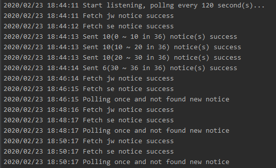

# SCUT_Academic_Notifier

+ RT the notices in SCUT Academic Notice (华工教务通知) and SE College Focus (软院公务通知)
+ [SCUT Office of Academic Affairs](http://jw.scut.edu.cn/zhinan/cms/index.do)
+ [SCUT Software Engineering College Focus](http://www2.scut.edu.cn/sse/xyjd_17232/list.htm)

### Requirement

+ Notifier: [ServerChan](http://sc.ftqq.com/3.version)

### Run

```bash
# Copy config.example.yaml to ./src/config/static.go
# Setup wechat key and send config

go run main.go
```

### Screenshots

+ Wechat


+ Server

